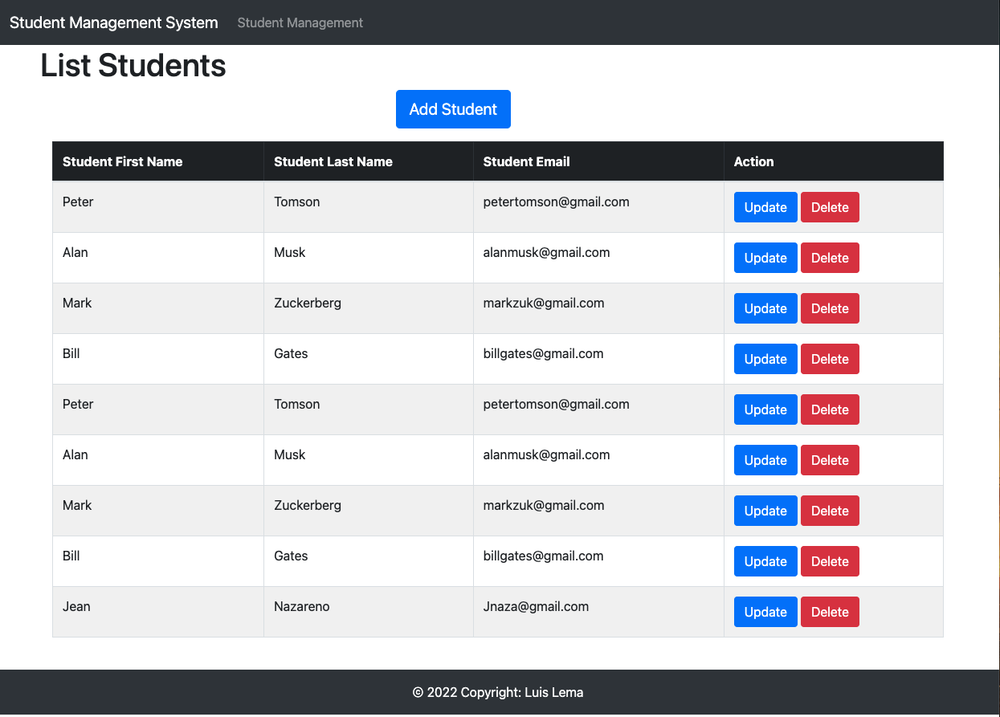
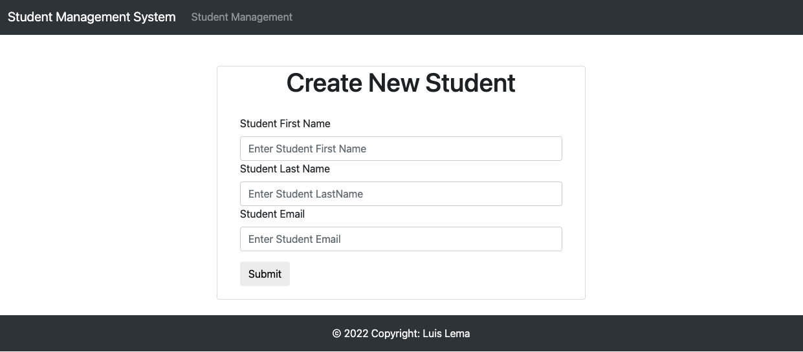
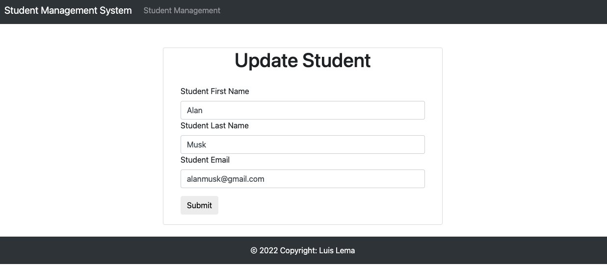

# Student-System-CRUD-API
Student system (Create, Read, Update, Delete)
# DEMO LINK: [DEMO Todo-List](http://luislemaspringbootawsstudentsystem-env.eba-upjv7bxn.us-east-2.elasticbeanstalk.com/students)

